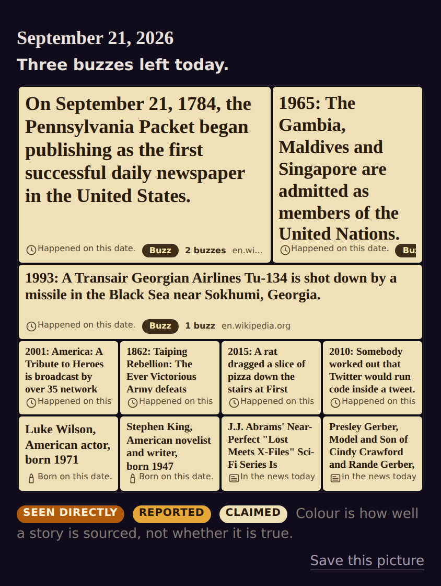
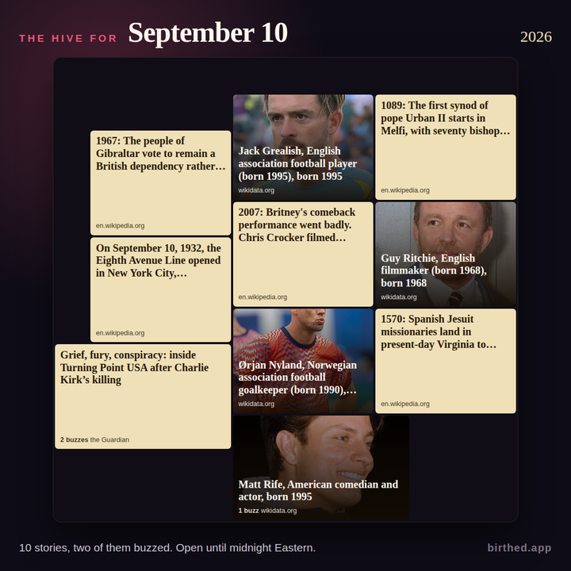
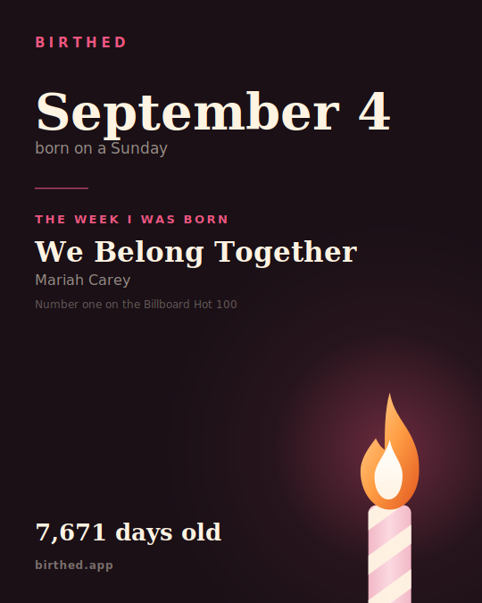
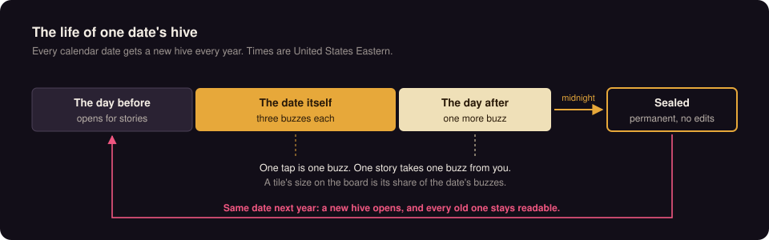
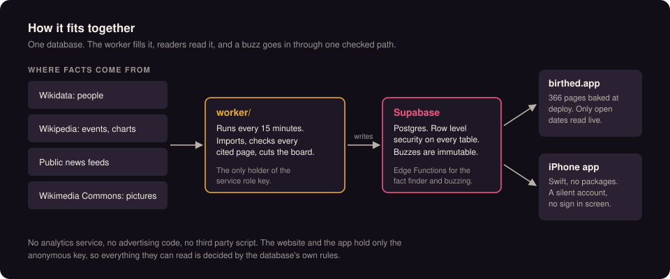

<p align="center">
  
</p>

<h1 align="center">Birthed</h1>

<p align="center"><b>Every date has a hive.</b></p>

<p align="center">
  <a href="https://github.com/jasonepage/Birthed/actions/workflows/checks.yml"></a>
  <a href="LICENSE"></a>
  
  
  
  
  
  <a href="https://testflight.apple.com/join/hzm6Mhhm"></a>
</p>

<p align="center">
  <a href="https://birthed.app">Website</a> ·
  <a href="docs/the-wall.md">How the hive works</a> ·
  <a href="#what-it-does-not-do">What it does not do</a> ·
  <a href="docs/objections.md">The objections, answered</a> ·
  <a href="https://birthed.app/privacy/">Privacy</a> ·
  <a href="SECURITY.md">Report a vulnerability</a>
</p>

---

**Every calendar date gets a public board of what happened on it, who was born
on it, what was number one and the day's news. On the date, anyone gets three
buzzes for what will still matter in ten years. At midnight Eastern the board
seals for good.**

<table>
  <tr>
    <td width="50%" valign="top"></td>
    <td width="50%" valign="top"></td>
  </tr>
  <tr>
    <td align="center"><sub>A date page on birthed.app, the hive leading it</sub></td>
    <td align="center"><sub>The same kind of board on a phone</sub></td>
  </tr>
  <tr>
    <td width="50%" valign="top"></td>
    <td width="50%" valign="top"></td>
  </tr>
  <tr>
    <td align="center"><sub>The picture a hive shares</sub></td>
    <td align="center"><sub>The card the iPhone app shares</sub></td>
  </tr>
</table>

Next year the same date opens a new hive, and the sealed one stays readable.
Birthed is a website at [birthed.app](https://birthed.app) and an iPhone app
in beta on [TestFlight](https://testflight.apple.com/join/hzm6Mhhm), Apple's
free app for trying apps before they are on the store. The date is the thing,
not the user. There is nothing to buy, no advertising, and no analytics
service or third party code of any kind.

<p align="center">
  
</p>

> **The website does not ask for an account and does not store your birthday.**
> The month and day you pick only choose which page to show. A birth year, if
> you give one, lives in one cookie in your own browser and nowhere else. The
> iPhone app is different and says so: it sends a month, a day and an optional
> year to a silent anonymous account. The [privacy page](https://birthed.app/privacy/)
> has the whole account, and it is edited in the same commit as the code.

## Try it in five minutes

No account and no keys for the tests: the website's tests run against a
mocked project, the worker's against fixtures, and the iOS domain from a
terminal. The same three run on every push in
[`.github/workflows/checks.yml`](.github/workflows/checks.yml), the badge above.

```
cd web && npm install && npm test
cd ../worker && npm ci && npm test
swift test        # the iOS domain, from a terminal, no Xcode
```

To run the website itself you need one value, the project's publishable key,
which is safe to ship and is the same key every live hive page already carries.
It is in the Supabase dashboard under Project Settings, API Keys, or copy it
out of the page source of any open hive on birthed.app. Then:

```
cd web && SUPABASE_ANON_KEY=... npm run site && npm run serve
```

That bakes all 366 date pages from the live, read only data and serves them
on port 10000. Buzzing from a local copy still goes to the live hive, which
is the one thing the site writes. The iPhone app needs `Birthed/Config/Secrets.swift`
with the same key; `CLAUDE.md` section 9 shows the two lines.

## Status, plainly

| | |
|---|---|
| **Website** | Live at [birthed.app](https://birthed.app). 366 date pages, and a hive on every date from the day before it. |
| **iPhone app** | In beta on [TestFlight](https://testflight.apple.com/join/hzm6Mhhm), not yet on the App Store. |
| **Team** | One developer. No company, no funding, no investors. |
| **Money** | None. Nothing to buy, no subscription, no advertising. |
| **Dependencies** | The website's server has no runtime packages. The iPhone app has no Swift packages. Neither has analytics, a crash reporter or advertising code. |
| **Data** | Wikidata, Wikipedia, Wikimedia Commons and public news feeds, each row stamped with its source and license. [Where the content comes from](#where-the-content-comes-from). |
| **Measuring** | The hive is judged on one number: of the people who buzz, how many come back and buzz on a different day. It means nothing until a month of real traffic, which had not started as of September 2026. `docs/measuring.md` says why. |

`CLAUDE.md` is the working record: every decision, why it was made, and what
turned out wrong. It is blunt on purpose, and it is the first thing to read
before changing anything.

## What is not done

- **The feed still reads like an encyclopedia.** Tiles are whole Wikipedia
  sentences, and some rows are templates ("was the number one album").
  `docs/editorial-pass.md` is the plan, and short headlines come with a rule
  written down first: shorten the source, never add to it.
- **Nobody born before 1600 is in the database yet.** The import reaches back
  to 1400 now, but it has not been run again, so there is no Leonardo, no
  Galileo and no Einstein until it is.
- **The website knows a birth year and not a birthday.** It treats the date
  being read as the reader's own, so on somebody else's date an age can be one
  year high.
- **"Claimed" is still the only tier in practice.** Nothing adds a second
  source to a story yet, so the three shades of honey on the board are one.
- **The iPhone app's screens are compiled only in Xcode.** Its domain, where
  nearly all the rules live, is compiled and tested on every push by the
  checks workflow; the SwiftUI views are not.
- **A migration in this repository can be newer than the live database.**
  `docs/going-public.md` lists the ones that are.
- **The reward catalog this started as is still here, unused.** It is built in
  the schema and tested, and `CLAUDE.md` section 5 records why it was cut.

## What it does not do

- It does not ask the website's readers to sign in, and it has no accounts to
  sign in to.
- It does not let a buzz be changed once it is cast, or a sealed hive be
  edited. The database trigger refuses both. The one exception written so
  far, taking a buzz back in its first thirty seconds, is in this repository
  and not yet on the live database.
- It does not send the device's location anywhere, or use it.
- It does not run a script on any page except `/add`, the private `/admin`
  pages, and the live hive of a date that is taking buzzes.
  `web/test/serve.test.ts` fails if any other page is allowed to.
- It does not send the list of birthdays you keep in the app anywhere. Only
  how many there are.
- It does not show a notification for a famous person's birthday. A
  notification is a promise that there is something to do.

## How it fits together

<p align="center">
  
</p>

The specifications are in `docs/specs/`: `PRD.md` (what the product is and
refuses to be), `SRS.md` (numbered requirements) and `SDS.md` (the design).
Large parts of all three describe the reward catalog, which is on the shelf.
The decisions made since are in `CLAUDE.md` section 5, and they win where the
two disagree.

## How the hive works

Everything with a birthday on a date sits in one pool: that day's news,
historical events, people born on it, and works released on it. The rules are
in `docs/the-wall.md`, which is the authority for every rule below; the
database enforces them in `supabase/migrations/20260909040000_the_wall.sql`
and the migrations after it.

- A date opens the day before it happens, for submissions only.
- On its own day and the day after, a visitor gets buzzes to spend: three on
  the date itself, one on the day after. `wall_boost_budget` in the database
  is the only place that number lives.
- One tap is one buzz, and one story takes at most one buzz from one visitor.
- A tile's size on the board is its share of the date's buzzes. When nobody
  has buzzed, the panel's points decide, and one buzz beats every score.
  `worker/src/wall/allocator.ts` cuts the board; `web/src/hive-allocator.ts`
  is a plain JavaScript copy used by the live page, and a test holds the two
  to the same output on four hundred generated boards.
- At midnight United States Eastern time ending the day after the date, the
  date seals. `wall_boosts` is immutable: its trigger refuses every update and
  every delete. Migration `20260911010000_thirty_seconds_to_take_it_back`
  adds one exception, a buzz taken back within thirty seconds of casting it
  on a date that has not sealed; as of September 21, 2026 that migration is
  in the repository and not on the live database.
- The same calendar date opens a new hive the following year. The old ones
  remain.

The drama, added September 23, 2026 (`docs/the-wall.md` section 30), is all
facts about tiles and never about a person:

- **The crown.** The most buzzed story wears one, held on a tie, and a list
  under the board keeps every change of hands: "3:12 pm Eastern: Bruce
  Springsteen took the crown from Typhoid Mary." Nothing records a takeover;
  `web/src/crown.ts` replays the buzz rows in the order they were cast.
- **Pick between two.** `/<date>/pick/` shows two stories and one question,
  which will people still care about in ten years. One tap is one buzz and
  the next pair comes up. It runs with no script.
- **Decade teams.** "The 1940s (Boomers) lead September 23 with 2 of 3
  buzzes." Counted by buzzes; a generation is named only when the decade's
  buzzed people all belong to one.
- **Refills, written and not on the live database yet.** The three buzzes
  arrive at midnight, 8 am and 4 pm Eastern instead of all at midnight.
  Migration `20260923010000_buzzes_that_refill` holds it.

The worker's tick, `worker/src/wall/tick.ts`, runs every fifteen minutes. It
files the date's imported history as stories, reads the public news feeds
listed in `worker/src/wall/news.ts`, checks every cited source, and writes a
snapshot of the board.

## Code worth reading

If you came for the engineering rather than the product, these are the parts
that took the most thought, each small enough to read in one sitting.

- **An immutable vote ledger in Postgres.** `wall_boosts` refuses every update
  and delete from a trigger, including the service role's, with one narrow
  thirty second exception that checks the row itself rather than trusting a
  session flag. `supabase/migrations/20260911010000_thirty_seconds_to_take_it_back.sql`.
- **One allocator, two languages, held together by a test.** The board is cut
  in TypeScript by the worker and in plain JavaScript in the browser, and
  `worker/test/wall-allocator-web.test.ts` runs both on four hundred generated
  boards and fails on any difference. `worker/src/wall/allocator.ts`.
- **A live page with no framework and no library.** The full screen hive
  speaks Supabase Realtime's Phoenix protocol by hand, reconciles after a
  reconnect instead of polling, and counts the reader's own buzz once when it
  arrives twice. `web/src/hive-live.ts`.
- **Dates that are never `Date`s.** A birthday is two integers, February 29
  is resolved at read time, and a notification is scheduled from calendar
  components with no time zone so it survives a flight.
  `Birthed/Domain/BirthdayCalendar.swift` and its tests.
- **A quotation check that refuses to guess.** Every source's quotation is
  matched against the fetched page by exact string; a page too big to read is
  unreadable, never truncated, because a match against half a page asserts
  something it cannot know. `worker/src/wall/page.ts` and `worker/src/wall/check.ts`.

## What happens to a reader's birthday

On the website, nothing is stored.

- The month and day a reader picks only choose which page to send them to.
  They are never written down. The `/year` handler in `web/src/serve.ts`
  answers the form.
- The birth year, if given, goes into one cookie in the reader's own browser
  and nowhere else. It turns on the song strip and the day counts. Choosing
  the blank option deletes it.
- The website has no accounts. Two pages run a script, `/add` and the live
  hive of a date currently taking buzzes; `securityFor` in `web/src/serve.ts`
  sets the content security policy per path and `web/test/serve.test.ts`
  asserts that no other path may run one. Every other page sends
  `default-src 'none'`.
- The iPhone app creates a silent anonymous account with a random token on
  first launch. `AccountService.pushProfile` sends a month, a day, an optional
  birth year and an optional typed region to that account. The list of other
  people's birthdays a reader adds never leaves the phone; only its length is
  sent, as `people_added_count`.
- The device's location is never used or sent.

The full account is on the [privacy page](https://birthed.app/privacy/), which
is edited in the same commit as any code that changes what it describes.

## Repository layout

| Path | What is in it |
|---|---|
| `Birthed/` | The iPhone app. Swift 6 with strict concurrency, SwiftUI, minimum target iOS 17. |
| `Birthed/Domain/` | Pure Swift. It imports Foundation and nothing else, holds the date arithmetic, and carries nearly all of the correctness risk. |
| `BirthedTests/DomainTests/` | The domain tests. |
| `Birthed.xcodeproj` | The Xcode project. |
| `Package.swift` | A Swift package at the repository root that compiles `Birthed/Domain/` and its tests, so they run from a terminal. |
| `web/` | birthed.app. A Node service that bakes 366 date pages at build time and serves them from disk with no database connection. |
| `worker/` | The importers and the hive's tick. Node and TypeScript, run in a container on a schedule. |
| `supabase/migrations/` | Every change to the database, in order. The database is never edited by hand. |
| `supabase/functions/` | Edge Functions: account deletion, the fact finder, the source finder for the hive, the day scanner, the reach measurer and the one write path for the hive. |
| `ingestion/` | A Python pipeline for cultural events. Its own `README.md` says how to run it. |
| `design/` | The app icon source. |
| `docs/` | How each decision was reached, including the ones that turned out wrong. |
| `docs/research/` | The research the decisions rest on. |
| `docs/specs/` | Product, requirements and design specifications. Large parts describe the reward catalog, which is built in the schema, tested, and unused. |
| `CLAUDE.md` | The working instructions and the decision record. It is blunt about what is broken and what has never been run. |
| `render.yaml` | The two Render services. |

## Requirements

- Node 22. `web/package.json` and `worker/package.json` declare `>=18.18.0`;
  Render runs 22.
- A Swift 5.9 toolchain or newer, for `swift test`. Xcode 16 or newer to
  build the app.
- Docker, only to build the worker's container the way Render does.
- The Supabase command line interface, only to apply migrations.
- Python 3, only for `ingestion/`.

## Building and running

### The website

```
cd web
npm install
npm run site
npm run serve
```

`npm run site` compiles the TypeScript and bakes the 366 date pages into
`web/out/`, which is not checked in. It reads the database through the
anonymous key, so it needs `SUPABASE_URL` and `SUPABASE_ANON_KEY` in
`web/.env`; `web/.env.example` shows the shape. `npm run serve` starts the
process that serves those pages. `npm run og` shoots the share images with
Playwright and needs a Chromium download.

### The worker

```
cd worker
npm install
npm run build
```

The worker is a set of scripts, each a script in `worker/package.json`:
`import:day`, `import:all`, `import:songs`, `import:albums`, `import:films`,
`import:events`, `import:culture`, `wall:seed`, `wall:news`, `wall:history`,
`wall:check`, `wall:tick`, `pictures` and others. Every one that writes needs
the service role key in `worker/.env`; `worker/.env.example` shows the shape.
The service role key bypasses row level security and must never appear in the
app target or in `web/`.

### The iPhone app

To try the built app without building it, join the beta on
[TestFlight](https://testflight.apple.com/join/hzm6Mhhm). To build it, open
`Birthed.xcodeproj` in Xcode. The app reads its two values from
`Birthed/Config/Secrets.swift`, which is not checked in:

```swift
enum Secrets {
    static let supabaseURL = URL(string: "https://<project>.supabase.co")!
    static let supabaseAnonKey = "<anonymous key>"
}
```

### The database

Migrations are applied with the Supabase command line interface, against a
project you own. `docs/going-public.md` lists migrations in this repository
that have been written and not applied to the live project.

## Running the tests

```
cd web && npm test
cd worker && npm test
swift test
```

Each `npm test` compiles the TypeScript and runs `node --test` over the
compiled test files. The web tests build a small site under `web/test-site/`
to serve it. `swift test` at the repository root compiles `Birthed/Domain/`
and `BirthedTests/DomainTests/` through `Package.swift`, with no Xcode
target. The app compiles the same domain files through the Xcode project. If
a domain file ever imports a framework, `swift test` is what fails first.

## How it is deployed

`render.yaml` describes two Render services in the Oregon region.

- `birthed-web`, a Node web service. Its build command installs dependencies,
  bakes the pages, and shoots the share images. It holds only the anonymous
  key. It rebuilds only when something under `web/` changes, so a change that
  lives in the database needs a manual deploy from the Render dashboard, or
  the site keeps serving the pages it was built with.
- `birthed-wall`, a cron job built from `worker/Dockerfile`, running
  `node dist/src/wall/tick.js` every fifteen minutes. It holds the service
  role key. Nothing on birthed.app depends on it running; a tick that fails
  leaves the hive as it was.

The Edge Functions under `supabase/functions/` are deployed with the Supabase
command line interface.

## Where the content comes from

- Names, birth and death years and one line descriptions of people come from
  Wikidata, under Creative Commons Zero. Every row records its source and
  license. Wikipedia article text is not used; `docs/specs/SDS.md` section 8.1 says why.
- Historical events come from Wikipedia's date articles, under Creative
  Commons Attribution ShareAlike, each with the page it came from.
- Chart weeks (the number one song, album and film) are parsed from
  Wikipedia's year lists, under Creative Commons Attribution ShareAlike, and
  every row carries the page it came from. The Hot 100 import begins with
  1959; a 1958 birthday shows no song, because that year's page could not be
  read without guessing.
- Event pictures are freely licensed files from Wikimedia Commons, copied at
  tile width. News pictures are the publisher's own preview image, recorded as
  belonging to the publisher and removed on request.
- The day's news comes from the public feeds listed in
  `worker/src/wall/news.ts`.
- Facts found about a specific date are found by a model that searches, run
  as an Edge Function, and each fact shows the page it cites. A run that
  reports no searches is discarded.
- The Fraunces typeface is served from `web/static/fonts/` under the SIL Open
  Font License, which is beside it.

Which record was number one on a given date is a fact and cannot be owned.
Birthed is not affiliated with Wikipedia, Wikidata, the Wikimedia Foundation,
Billboard, Penske Media or Google.

## License

The code is under the GNU Affero General Public License version 3.0, in
`LICENSE`. Content imported from Wikidata, Wikipedia and Wikimedia Commons
keeps the license of its source, recorded on every row.
